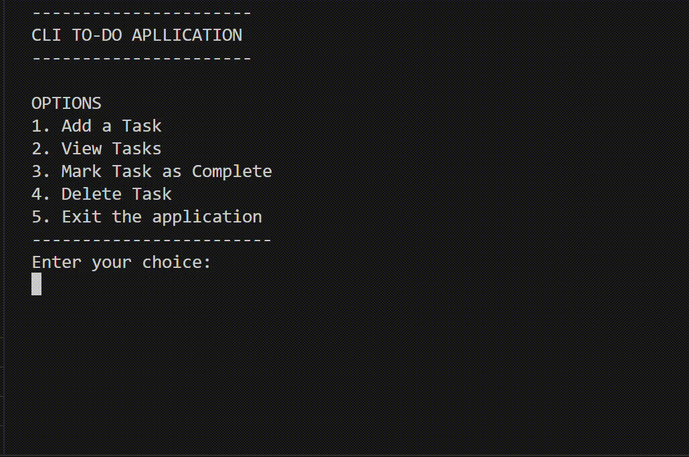

# todo-cli-go

# ✅ Go To-Do CLI

Welcome to my first Go project! 🎉  
This is a simple and fun command-line To-Do app built with Go. You can add, view, complete, and delete tasks—all from your terminal!


---


## 🎬 Demo

Here’s a quick look at the CLI To-Do App in action:



---

## 🚀 How to Run

```bash
go build -o todo
./todo
```

---

## 📋 What You Can Do

- 🆕 Add a task
- 📜 View your tasks
- ✅ Mark tasks as done
- ❌ Delete tasks
- 👋 Exit the app

All tasks are saved in a local `task.json` file.

---

## 📁 Project Structure

- `main.go` — The main CLI application logic
- `task.json` — Stores your tasks in JSON format

---


## 🛠 Built With

- [Go](https://golang.org) 💙

---

## 🤝 Contributing

Pull requests are welcome! If you have suggestions or want to improve the app, feel free to fork and contribute.

---

## 🙌 Author

Made with ❤️ by [Jigyasha](https://github.com/jigyasha-rjb) — My first Go project!

---

## 📄 License

MIT — use it, learn from it, build on it!

---

